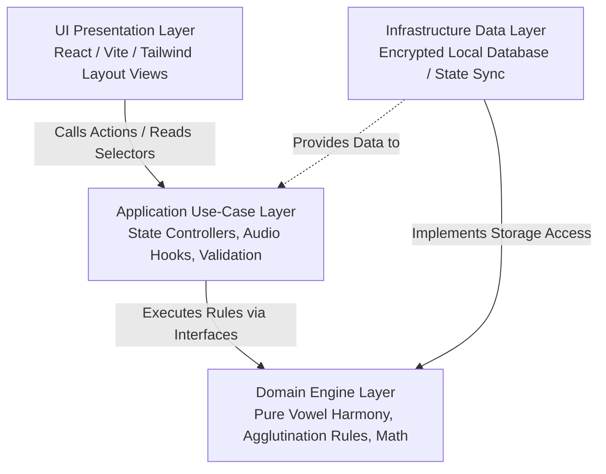

# Technical Specification: Offline Albanian-Turkish Language Learning Framework (A1-C2)

This document establishes the architecture, layout system, data schema, and technical design patterns for an enterprise-grade, offline-first language learning platform tailored specifically for Albanian speakers learning Turkish.

---

## 1. Project Core Vision & Linguistic Strategy

Unlike generic language learning software, this application leverages structural and historical overlaps between the Albanian and Turkish languages to optimize the learning curve.

### Native Linguistic Shortcuts
1. **Agglutination & Noun Cases:** Albanian speakers naturally understand noun cases and suffix attachment mechanisms (e.g., *Shkollë* $\rightarrow$ *Shkollat* directly mapping to *Okul* $\rightarrow$ *Okullar*). The engine skips generic conceptual explanations of suffixes and maps them directly to Albanian structural changes.
2. **Shared Balkan Lexicon:** The database contains an explicit tagging system for words inherited through historical contact (e.g., *dollap, xham, çorape, kuti, bela*), bypassing deep memorization drills for these items.
3. **The Indirect Past Tense Match:** The complex Turkish past tense suffix (`-miş`) is mapped directly to the unique Albanian Mënyra Habitore (*paska ardhur* $\rightarrow$ *gelmiş*), eliminating a major conceptual barrier for intermediate and advanced learners.

---

## 2. System Architecture Layers (Clean Architecture)

To ensure that modifying content, visual styles, or local storage mechanisms does not cause system-wide code breakage down the road, the application implements a strict Clean Architecture model with unidirectional data flow.



### Core Design Patterns
*   **Strategy Pattern (Grammar Engine):** Suffix rules are treated as interchangeable strategies (`PluralStrategy`, `DativeStrategy`). The software determines at runtime which rule to apply to a noun or verb root based on phonetic constraints (Vowel Harmony), keeping code free of nested conditionals.
*   **Repository Pattern (Data Decoupling):** The UI reads data from a unified interface repository (`ChapterRepository`). Whether the underlying data source is a raw local JSON array file or a fully encrypted local SQLite engine, the UI code remains completely unchanged.

---

## 3. UI Layout & Navigation Blueprint (Single-Page Chapter Engine)

The core user experience centers on a **Single-Page Scrollable Chapter Engine**. Once a user selects a chapter from the Lesson Dashboard, they enter a self-contained environment containing all material for that chapter.

### Screen Layout Hierarchy

```
┌────────────────────────────────────────────────────────────────────────┐
│ Header: [Back to Dashboard]          Chapter Title: Mësimi 1 (A1)      │
├────────────────────────────────────────────────────────────────────────┤
│ [ Tab 1: Reading ] [ Tab 2: Vocab ] [ Tab 3: Grammar ] [ Tab 4..5 ]    │ ◄── Sticky Navigation Window Panel
├────────────────────────────────────────────────────────────────────────┤
│                                                                        │
│  SECTION 1: Reading & Listening                                        │ ◄── Scrolls to anchor point when
│  ┌──────────────────────────────────────────────────────────────────┐  │     top tabs are clicked
│  │ Text / Dialogue Box (Turkish)                                    │  │
│  │ [Audio Hook Button - Nonfunctional Stub]                          │  │
│  │ ──────────────────────────────────────────────────────────────── │  │
│  │ (Albanian Translation - Toggle Hidden by Default)                │  │
│  └──────────────────────────────────────────────────────────────────┘  │
│  ┌──────────────────────────────────────────────────────────────────┐  │
│  │ Comprehension Questions Loop                                      │  │
│  │ Q1: Multiple choice checking understanding of text above         │  │
│  └──────────────────────────────────────────────────────────────────┘  │
│                                                                        │
│  SECTION 2: Vocabulary Acquisition                                     │
│  ...                                                                   │
└────────────────────────────────────────────────────────────────────────┘
```

### Navigation Window Mechanics
*   **Top Sticky Panel:** A fixed toolbar containing 5 interactive tab buttons: *Reading/Listening*, *Vocabulary*, *Grammar*, *Writing*, and *Exercises*.
*   **Smooth Anchor Scrolling:** Clicking any tab performs an immediate hardware-accelerated scroll to the corresponding section element's vertical coordinate (`element.scrollIntoView()`) within the single-page chapter.
*   **Intersection Observer Tracking:** As the user naturally scrolls vertically through the page content, an internal observer listener monitors which section occupies the main viewport area and automatically highlights the matching active window tab in the top navigation bar.

### Typography Specifications
*   **Global Layout:** Designed mobile-first, ensuring all interactive inputs fall within standard thumb-reach layout sectors.
*   **Primary Font:** *Inter* (Geometric Sans-Serif) for clean layout tracking and pristine rendering of Albanian characters (`ë`, `ç`).
*   **Technical Font:** *Plus Jakarta Sans* for Turkish text fields. Suffix highlights use character track styling (`letter-spacing: 0.05em`) and structural bold configurations to isolate agglutinated root mutations clearly.

---

## 4. Detailed Component & Section Flow Specification

Every chapter, regardless of difficulty rating (A1 through C2), sequentially initializes the following 5 distinct layout modules on the single page:

### A. Reading & Listening Module
*   **Content Types:** Renders complex structural texts, authentic local dialog layouts, multi-character scripts, or informational logs depending on the difficulty index.
*   **Audio Asset Strategy:** Fully integrates the architectural layout hooks, state variables, and execution triggers for audio streaming media. To maintain minimal initial distribution sizes, the underlying player methods are currently loaded as non-functional placeholder code stubs ready for future file path integrations.
*   **Comprehension Framework:** Instantly follows the primary reading content blocks. Users are blocked from advancing past the module until they answer an array of built-in multi-option reading comprehension questions tracking text details.

### B. Vocabulary Acquisition Module
*   **Layout:** A highly optimized semantic grid listing lexical items introduced in the text.
*   **Structure:** Each word entry exposes the Turkish word string, the literal Albanian meaning bracket, contextual dictionary tag modifiers highlighting overlapping vocabulary roots (shared Balkanisms), and integrated placeholder triggers for upcoming audio files.

### C. Grammar Presentation Module
*   **Format Layout:** Structured as a segmented, step-by-step card carousel interface to prevent cognitive overload.
*   **Carousel Mechanics:** Instead of long, intimidating textbook articles, rules are broken into standalone, bite-sized instructional views. Users navigate via horizontal swipe controls or clean "Prapa" (Back) / "Para" (Forward) buttons.
*   **Linguistic Mapping:** Every grammar carousel card strictly presents a Turkish morphological rule accompanied by its corresponding structural variant in the Albanian linguistic system.

### D. Writing Engine Module
*   **Configuration Overlay:** Prior to opening the input console text fields, the UI launches a clean selector modal requiring the user to explicitly define their evaluation mode preference:
    1.  **Model Answer Verification (Default Mode):** Displays a text input module for writing. Upon submission, the engine renders an idealized correct sample text option alongside literal translation notes, allowing the student to audit their own work. This mode consumes the lowest runtime computing overhead.
    2.  **Strict Engine Validation:** Executes programmatic, character-by-character string alignment checking using a predefined array of correct regex validation schemas. It marks spellings and suffix alignment strictly, forcing adjustments before saving the block.
*   **System Input Optimization:** Features a custom in-app character helper key-row overlay (`ç, ğ, ı, ö, ş, ü`), eliminating the dependency for users to configure or install secondary keyboard tracking layouts on their physical operating system environments.

### E. Interactive Exercises Module
*   **Architecture Layout:** A dynamic sub-view template wrapper that reads a collection of test items and renders them using specialized interaction components:
    *   **Type A (Multiple Choice):** Fast suffix identification checks.
    *   **Type B (Word Sorting):** Dispersed sentence block elements that must be rearranged into accurate syntax order.
    *   **Type C (Agglutination Builder):** Dragging structural modification markers to attach smoothly onto a static base noun string.

---

## 5. Technical Database Relational Schema

This relational schema uses independent, isolated configuration schemas, enabling content updates for any tier (A1 through C2) to layer effortlessly onto the system database without structural database redesigns.

```sql
-- 1. Chapter Root Definition Table
CREATE TABLE chapters (
    id INTEGER PRIMARY KEY AUTOINCREMENT,
    level TEXT NOT NULL,                  -- Valid Enum Bounds: 'A1', 'A2', 'B1', 'B2', 'C1', 'C2'
    order_index INTEGER NOT NULL,         -- Strict sequencing index within a given level
    title_albanian TEXT NOT NULL,         -- e.g., 'Prezantimi dhe Koha e Tashme'
    title_turkish TEXT NOT NULL,          -- e.g., 'Tanışma ve Şimdiki Zaman'
    UNIQUE(level, order_index)
);

-- 2. Reading Texts & Dialogue Schemas
CREATE TABLE reading_blocks (
    id INTEGER PRIMARY KEY AUTOINCREMENT,
    chapter_id INTEGER NOT NULL,
    layout_style TEXT NOT NULL,           -- Enum types: 'dialogue', 'narrative', 'blog_post'
    content_turkish TEXT NOT NULL,        -- Complete source text string
    content_albanian TEXT NOT NULL,       -- Paired translation payload
    audio_asset_stub TEXT,                -- Preconfigured path slot for future media integration
    FOREIGN KEY(chapter_id) REFERENCES chapters(id) ON DELETE CASCADE
);

-- 3. Reading Comprehension Questions
CREATE TABLE reading_questions (
    id INTEGER PRIMARY KEY AUTOINCREMENT,
    reading_block_id INTEGER NOT NULL,
    question_turkish TEXT NOT NULL,
    question_albanian TEXT NOT NULL,
    options_json TEXT NOT NULL,           -- Encoded array string: ["Option A", "Option B", "Option C"]
    correct_index INTEGER NOT NULL,       -- Targeted array tracking identifier index
    FOREIGN KEY(reading_block_id) REFERENCES reading_blocks(id) ON DELETE CASCADE
);

-- 4. Vocabulary Matrix Table
CREATE TABLE vocabulary (
    id INTEGER PRIMARY KEY AUTOINCREMENT,
    chapter_id INTEGER NOT NULL,
    turkish_word TEXT NOT NULL,
    albanian_word TEXT NOT NULL,
    is_shared_balkan_word INTEGER DEFAULT 0, -- Boolean structural flag override
    notes_albanian TEXT,
    audio_asset_stub TEXT,
    FOREIGN KEY(chapter_id) REFERENCES chapters(id) ON DELETE CASCADE
);

-- 5. Segmented Grammar Carousel Step Records
CREATE TABLE grammar_cards (
    id INTEGER PRIMARY KEY AUTOINCREMENT,
    chapter_id INTEGER NOT NULL,
    step_order INTEGER NOT NULL,          -- Controls horizontal slider view rendering sequencing
    title_albanian TEXT NOT NULL,
    rule_concept_turkish TEXT NOT NULL,   -- Structural display rule
    explanation_albanian TEXT NOT NULL,   -- Step body narrative
    interactive_example_json TEXT,        -- Structured context mapping rules: {"root": "git", "suffix": "iyor", "result": "gidiyor"}
    FOREIGN KEY(chapter_id) REFERENCES chapters(id) ON DELETE CASCADE
);

-- 6. Interactive Exercise Specification Master Table
CREATE TABLE exercises (
    id INTEGER PRIMARY KEY AUTOINCREMENT,
    chapter_id INTEGER NOT NULL,
    exercise_type TEXT NOT NULL,          -- Enum keys: 'MULTIPLE_CHOICE', 'WORD_SORT', 'SUFFIX_BUILDER'
    prompt_albanian TEXT NOT NULL,        -- Instruction string text
    source_payload_json TEXT NOT NULL,    -- Declarative schema parameters matching layout needs
    validation_target_json TEXT NOT NULL, -- Target solution matrices used by verification runtime
    FOREIGN KEY(chapter_id) REFERENCES chapters(id) ON DELETE CASCADE
);

-- 7. Secure Local User Progress & State Engine Serialization
CREATE TABLE user_progress (
    id INTEGER PRIMARY KEY AUTOINCREMENT,
    chapter_id INTEGER UNIQUE NOT NULL,
    is_completed INTEGER DEFAULT 0,
    last_accessed_timestamp INTEGER NOT NULL,
    last_viewed_section TEXT NOT NULL,    -- Tracks active tab anchor coordinate state preservation
    carousel_grammar_step INTEGER DEFAULT 0, -- Preserves exact index location inside grammar sliders
    writing_validation_preference TEXT,   -- Stores 'SELF_CHECK' or 'STRICT' validation choices
    FOREIGN KEY(chapter_id) REFERENCES chapters(id) ON DELETE CASCADE
);
```

---

## 6. Security, Futureproofing, & State Preservation Plan

### Data Integrity & Protection Checklist
*   **Database Lockout (SQLCipher):** To prevent unauthorized redistribution of the unique, hand-crafted core translation tables, the local SQLite system database is compiled and locked using an embedded SQLCipher processing layer. The runtime memory reads the content seamlessly, but raw filesystem copies remain unreadable strings.
*   **Content Isolation Policy:** The application manifest file declares a strict, locked network connection configuration strategy. It blocks the processing of any third-party script wrappers or unverified origin domain paths, ensuring the engine processes data solely inside its local offline playground container.

### Pristine State Serialization Engine
*   **Resuming Sessions Effortlessly:** The application tracks state updates dynamically as changes happen. When a user exits the application sandbox mid-lesson, the system intercepts the event loop and serializes the exact user location context to the `user_progress` storage partition.
*   **Launch Processing Flow:** On application initialization, the app bootloader queries the `user_progress` table for the latest `last_accessed_timestamp`. Instead of routing the student back to the global landing menu options, it bypasses the dashboards, updates the active page component viewport directly to the specific saved chapter, scrolls the page view straight down to their last active section coordinate, and restores their current position inside the grammar carousel component flawlessly.
